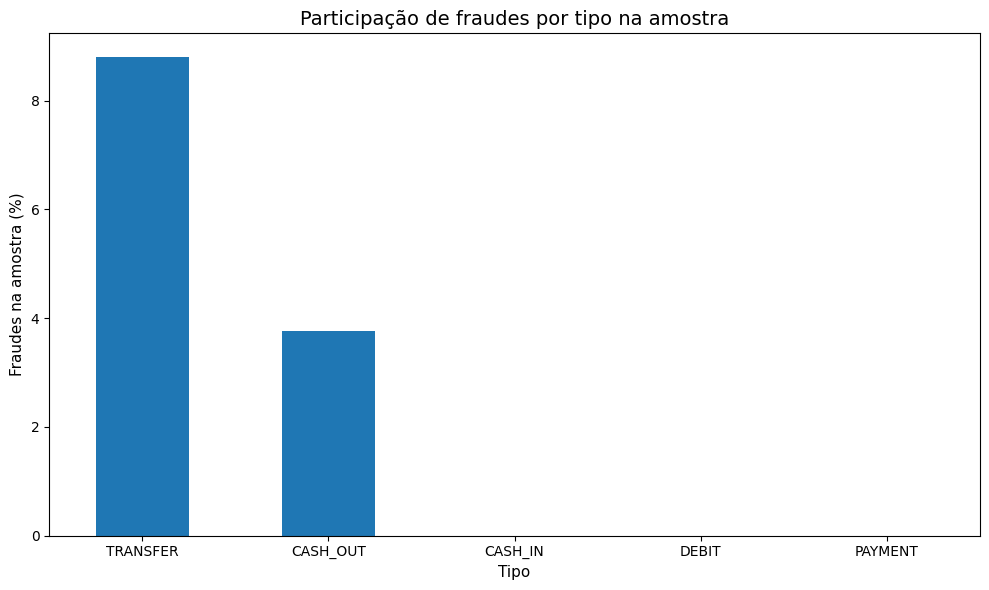
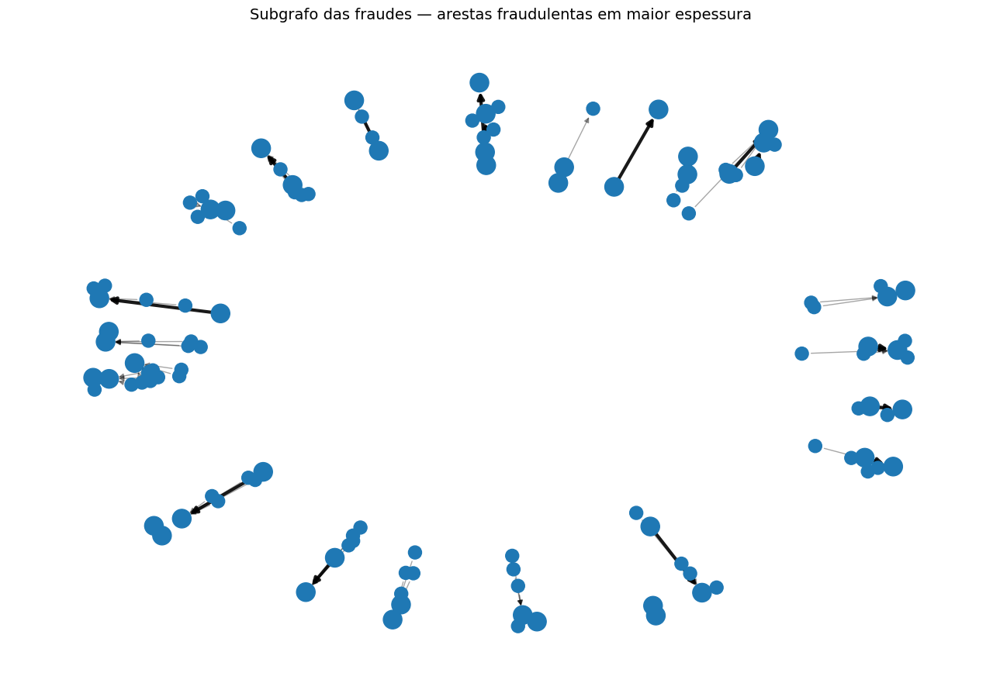
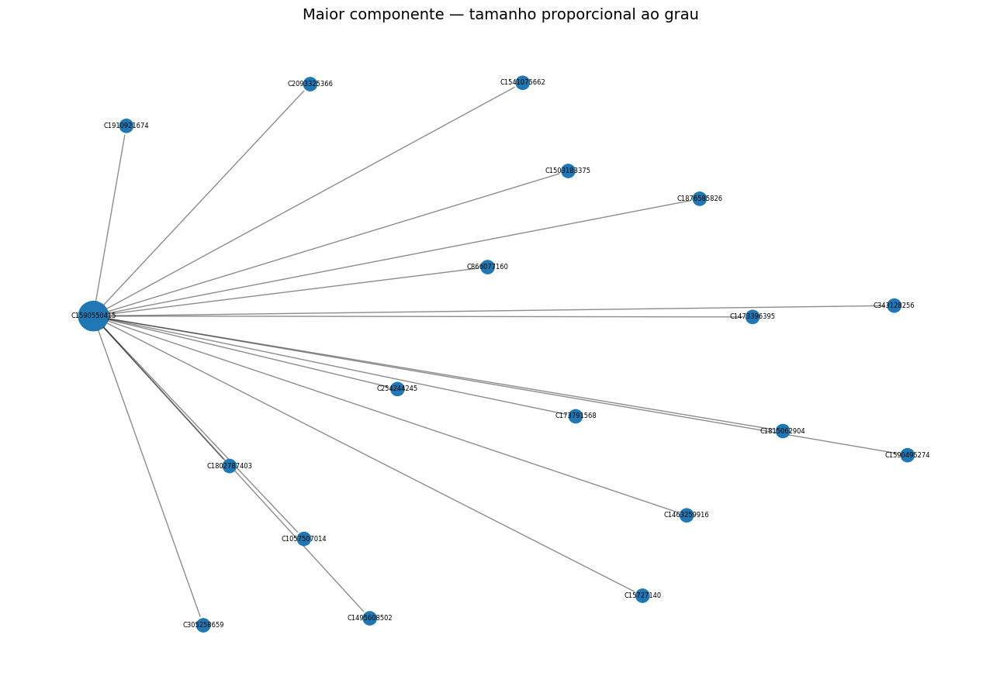
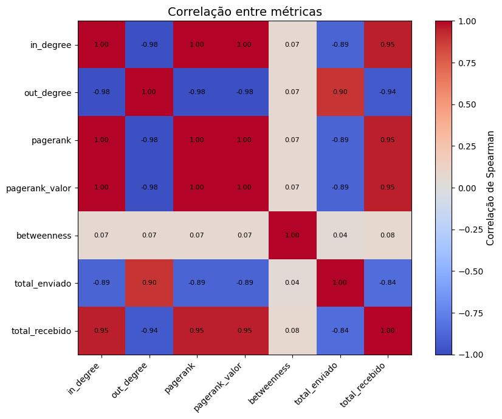

# PaySim — análise de fraude com grafos

[](https://github.com/victorhugo-ml/paysim-fraud-network-analysis/actions/workflows/ci.yml)

Análise exploratória de transações financeiras sintéticas usando **DuckDB**, **pandas** e grafos direcionados com **NetworkX**.

O projeto investiga a seguinte pergunta:

> A estrutura de uma rede de transações financeiras permite identificar padrões associados às fraudes selecionadas?

[Abrir o notebook executado](notebooks/paysim_fraud_network_analysis.ipynb)

## Visão geral

O dataset PaySim possui milhões de transações. Para manter a análise leve e visualmente explorável, o notebook constrói uma amostra de exatamente **1.000 transações**.

Uma amostra aleatória pequena poderia eliminar recorrências, caminhos e hubs relevantes. Por isso, a seleção é orientada à estrutura da rede e combina:

- 25 fraudes distribuídas no tempo;
- contas que aparecem como origem e destino;
- hubs de recebimento;
- vizinhanças das contas selecionadas;
- transações normais para completar a amostra.

O **DuckDB** consulta o CSV completo com SQL sem carregá-lo integralmente em um DataFrame. Depois da amostragem, **pandas** trata os dados e o **NetworkX** modela cada conta como nó e cada transação como aresta direcionada.

```text
PaySim completo
      |
      v
DuckDB + SQL
      |
      v
Amostragem estrutural (1.000 transações)
      |
      +--> pandas / análise exploratória
      |
      +--> NetworkX / métricas e subgrafos
      |
      v
Resultados, visualizações e exportação para Gephi
```

## Principais resultados

| Indicador | Resultado |
| --- | ---: |
| Transações analisadas | 1.000 |
| Períodos (`steps`) representados | 305 |
| Fraudes selecionadas | 25 |
| Nós | 1.780 |
| Arestas agregadas | 1.000 |
| Densidade | 0,000316 |
| Maior componente fracamente conexa | 19 nós |
| Reciprocidade | 0 |
| Clustering médio | 0 |
| Maior k-core | 1 |

Na amostra executada:

- os 50 nós associados às fraudes selecionadas tiveram **in-degree médio de 1,88**, ante **0,52** nos demais nós;
- o PageRank médio desses nós foi **0,000985**, ante **0,000550** nos demais;
- o valor mediano das transações fraudulentas foi **722.832,95**, ante **96.824,08** nas transações normais;
- a conta de origem terminou com saldo zero em **100%** das fraudes selecionadas, contra **24,82%** das demais transações.

Essas diferenças são **exploratórias**. Elas não representam a população do PaySim e não demonstram capacidade preditiva.

## Visualizações

<table>
  <tr>
    <td align="center">
      <br>
      <sub>Fraudes selecionadas por tipo de transação</sub>
    </td>
    <td align="center">
      <br>
      <sub>Subgrafo das fraudes e suas vizinhanças</sub>
    </td>
  </tr>
  <tr>
    <td align="center">
      <br>
      <sub>Maior componente fracamente conexa</sub>
    </td>
    <td align="center">
      <br>
      <sub>Correlação de Spearman entre métricas</sub>
    </td>
  </tr>
</table>

## Métricas estudadas

- in-degree e out-degree;
- PageRank topológico e ponderado por valor;
- betweenness centrality;
- densidade, grau médio e reciprocidade;
- componentes fracas e fortes;
- clustering e k-core;
- assortatividade;
- correlação de Spearman entre centralidades e fluxos financeiros.

O notebook usa um `MultiDiGraph` para preservar transações individuais e um `DiGraph` agregado para analisar relações entre contas.

## Limitações metodológicas

A amostra foi construída deliberadamente para preservar fraudes e estruturas interessantes. Portanto:

- a proporção de fraude não estima a prevalência real;
- diferenças entre grupos não sustentam inferência causal;
- a estratégia de amostragem influencia as propriedades do grafo;
- o projeto não treina nem avalia um classificador de fraude;
- centralidade não deve ser interpretada como evidência de comportamento fraudulento.

A principal conclusão metodológica é que, em redes grandes, **a estratégia de amostragem faz parte do problema analítico**.

## Como executar

Requisitos: Python 3.11 ou superior e Jupyter.

```bash
python -m venv .venv
```

Ative o ambiente virtual e instale as dependências:

```bash
pip install -r requirements.txt
jupyter lab
```

Abra `notebooks/paysim_fraud_network_analysis.ipynb` e execute as células em ordem. O notebook baixa o PaySim por meio do `kagglehub`; o CSV não é versionado neste repositório.

## Estrutura

```text
.
├── notebooks/
│   └── paysim_fraud_network_analysis.ipynb
├── docs/
│   └── images/
├── scripts/
│   └── validate_notebook.py
├── DATASET.md
├── requirements.txt
└── README.md
```

## Dataset e atribuição

O PaySim é um dataset sintético gerado por um simulador de transações de mobile money. O dataset não está incluído no repositório.

- [Dataset no Kaggle](https://www.kaggle.com/datasets/ealaxi/paysim1)
- [Projeto original PaySim](https://github.com/EdgarLopezPhD/PaySim)
- E. A. Lopez-Rojas, A. Elmir e S. Axelsson. *PaySim: A financial mobile money simulator for fraud detection*. EMSS, 2016.

Consulte [`DATASET.md`](DATASET.md) para detalhes de uso e atribuição.

## Contexto

Projeto acadêmico e de portfólio desenvolvido de forma iterativa. Ferramentas de IA generativa apoiaram a revisão editorial, a organização da documentação e a checagem conceitual. A definição do problema, as decisões metodológicas, a execução do código, a interpretação dos resultados e a responsabilidade pelo conteúdo permanecem do autor. Nenhum resultado quantitativo foi gerado ou estimado por IA.
